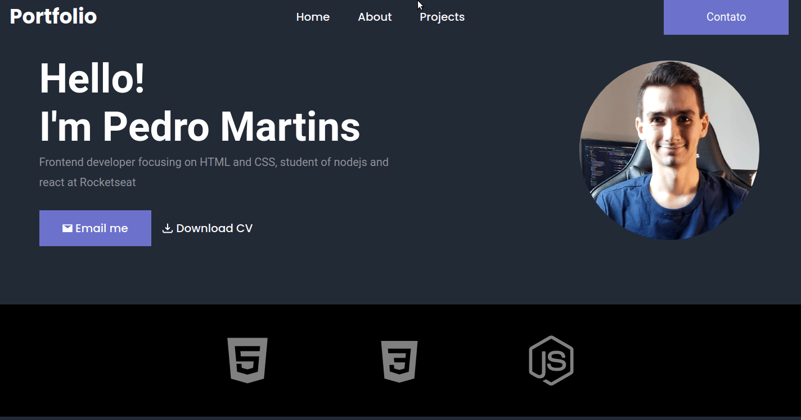

# Portfolio

## :books: Projeto

Portfólio estático(sem back-end) para o github pages.

## :computer: Tecnologias

Foram usadas as seguintes tcnologias neste projeto:

- HTML
- CSS 

## :smiley: Como vizualizar?

Basta Acessar esse link:

[Portfólio](https://pedromartinscap.github.io/portfolio-without-backend/index.html)

## :clap: Créditos
  ### Ícones

  [icons8](https://icons8.com.br/)

Feito com :blue_heart: por Pedro Henrique - [LinkedIn](https://www.linkedin.com/in/pedrohenriqueoliveiramartins/)